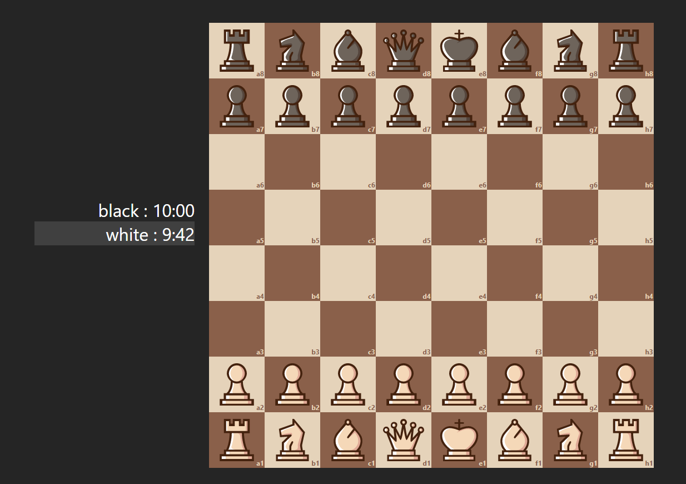
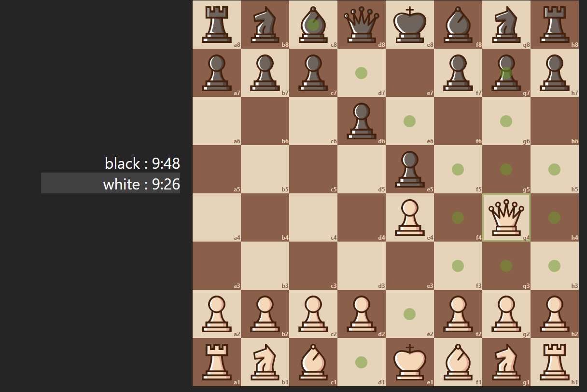
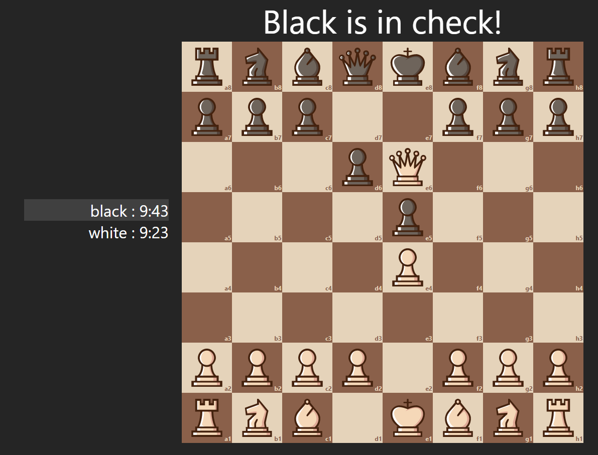
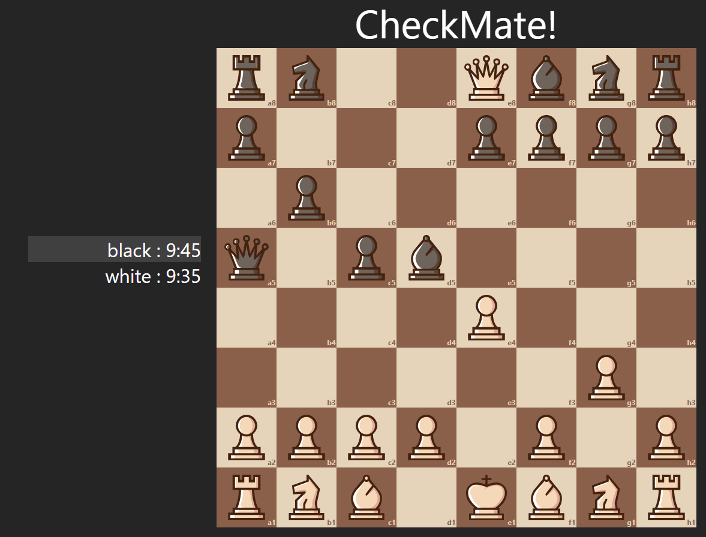

# chess
- A React chess web application with move indicators that is 
created using hooks and context.
- Enables maneuvers such as castling and pawn promotion.
- Checks if user is ever under check or checkmate.

## Final Product

## Getting Started

1. Fork this repository, then clone it.
2. CD into the client subfolder
3. Install the dependencies using the `npm install` command.
4. Run `npm start` to start the web application which is viewable from your web browser.

## Dependencies
- React
- Context
- Typescript
- SCSS

